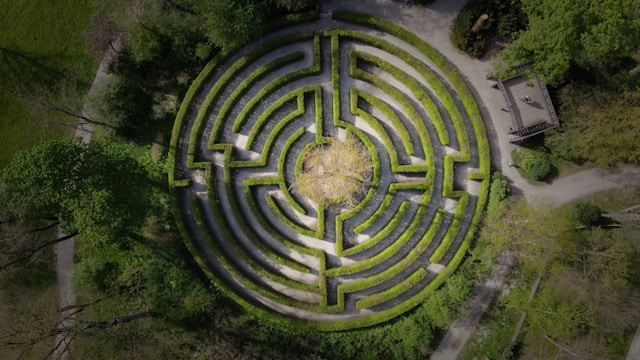

# Kimberly Gier
### I am learning data analytics!

---
### Goals
* Learn to code with Python
* Learn to access and use various data sources
* Learn to create interesting and useful visualizations
* Do a cool capstone project and tell a compelling data story
* Find someone who wants to pay me to play with data 

--- 
[What can I do with Python?](https://www.datacamp.com/blog/what-is-python-used-for "What is Python Used For?")

---

This is a hedge maze photographed from above by photographer Ben Mathis Siebel. I chose this image because although this maze almost certainly looks complicated to people walking through it, from the photographer's perspective, it's actually very simple.
I hope that all of the complicated-looking things that we are learning in this course will turn out to be equally simple once I'm looking at them the right way. 
